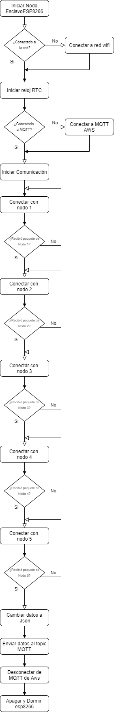
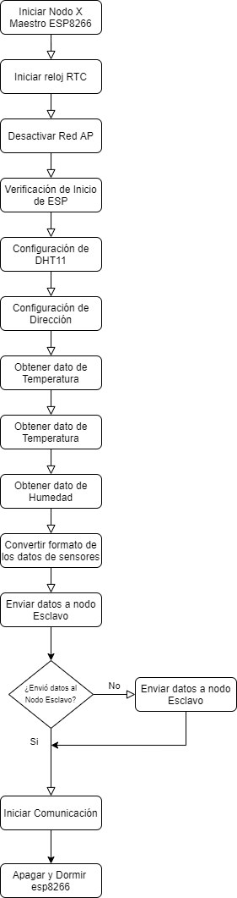
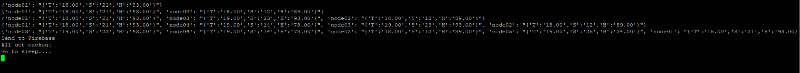
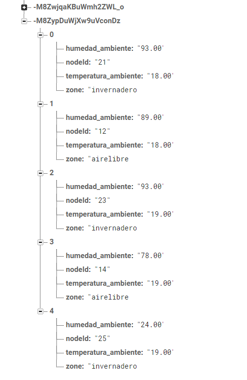
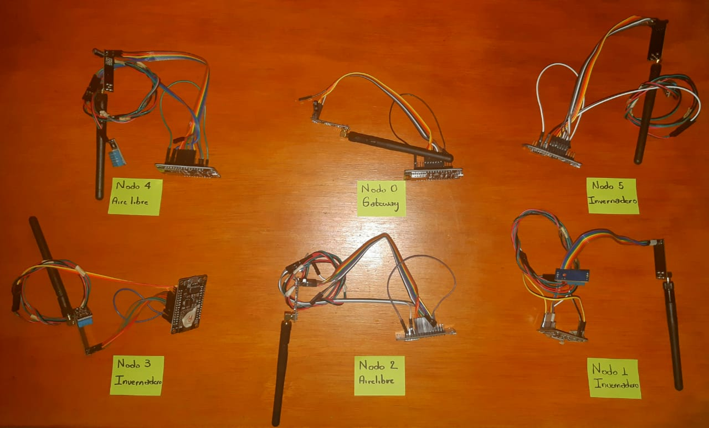

# WSN-MICROPYTHON

[](https://travis-ci.org/joemccann/dillinger)

Proyecto básico de red de nodos (WSN), utilizando el transceptor NRF24L01+ con el ESP8266 y el sensor de temperatura y humedad DHT11, usada para obtener datos en 5 nodos y enviar estos datos a un gateway que se conecta con AWS-IOT, ejecuta una regla del topic selesccionado, que posteriormente activa un script para enviar o insertar los datos a una base de datos, en este proyecto nos conectamos a dos bases de datos DynamoDB de AWS y Firebase, el envio a la base de datos depende del tema MQTT seleccionado, todo esto se ejecuta sobre Micropython, en este repositorio se enseña como configurar cada nodo, como funcinan los scripts, y como configurar AWS para poder replicado facil y rapidamente. Este proyecto se realiza utilizando una raspberry cargar el código y hacer pruebas sobre el proyecto.

Puede saber más sobre [Micropython](https://micropython.org/) en su pagina oficial.
También puede consultar la documentación  de [Micropython](https://docs.micropython.org/en/latest/index.html) para entender como trabaja.

A continuación se muestran el paso a paso para poder construir el proyecto: 

  - Configuración de Esp8266 con micropython
  - Cargar los scripts, certificados y llaves a la esp8266 usando una herramienta
  - Conexión de nodos
  - Cómo funciona el proyecto
  - Visualizar los datos en consola, utilizando minicom
  - Pruebas y resultados obtenidos


Para replicar este proyecto necesitará:
 - Esp8266
 - Nrf24l01
 - DHT11
 - OS Linux - En nuestro caso utilizamos una Raspberry Pi


## Configuración de Esp8266 con micropython

Para iniciar debe tener a mano una ESP8266, conectela a su computadora, en este caso utilizamos una raspberry para configurarlo. Utilizando la terminal instalamos las siguientes herramientas, python3 o python2, esptool (Herramienta que nos permite hacer el flash sobre la esp8266 y cargar el firmware), minicom (permite ver por comunicación serial lo que imprime nuestros nodos).

Entonces instalamos usando la terminal conectados desde Putty, primero actualizamos nuestra RPI

#### Actualizar sistema operativo 
```sh
$ sudo apt-get update
$ sudo apt-get upgrade -y
```

#### Instalamos Python:
```sh
$ sudo apt-get install python3 python
```
#### Instalamos PIP (Herramienta de python para descargar módulos):
```sh
$ sudo apt install python3-pip
$ sudo apt install python-pip
```
#### Instalamos esptool
```sh
$ sudo pip install esptool.
```
#### Instalar minicom
```sh
$ sudo apt-get install minicom.
```
#### Para iniciar minicom, simplemente se hace con:
```sh
$ minicom -s
```
### Descargar el Firmware para la esp8266
Lo descargamos de la pagina oficial de micropython si posee un esp8266 con 1024 Kb de flash necesitan la versióm estable, si posee un esp8266 con 512 Kb necesitan la daily de 512 Kb.

Enlace directo a la página: [Descargar el Firmware](https://micropython.org/download/esp8266/)
Para este caso utilizamos el Firware estable, 1M o más de flash: [esp8266-20191220-v1.12.bin](https://micropython.org/resources/firmware/esp8266-20191220-v1.12.bin), puede descargarlo directamente con este enlace.

### Carpeta del proyecto
Recuerde que estamos haciendo esto sobre la raspberry, por lo tanto copie este archivo en una carpeta para realizar el proyecto.
```sh
$ mkdir wsn
$ cd wsn
```

### Herramienta Micropython
El proyecto de [Micropythone](https://github.com/micropython/micropython) en GIT, posee distintas herramientas para facilitar el desarrollo de proyectos, en nuestro caso utilizaremos un script llamado  [pyboard.py](https://github.com/micropython/micropython/blob/master/tools/pyboard.py), descarguelo o copie y pegue el codigo en un script nuevo.
```sh
$ sudo nano pyboard.py
```
#### ¿Cómo funciona esta herramientas?
Su principal funcionalidad es descrita en el proyecto: 

> "Este módulo proporciona la clase Pyboard, utilizada para comunicarse con y
> controlar un dispositivo MicroPython a través de un canal de comunicación. Tanto real
> se admiten placas y dispositivos emulados (por ejemplo, que se ejecutan en QEMU).
> Se admiten varios canales de comunicación, incluido un serial
> conexión, conexión de red estilo telnet, proceso externo conexión."

Puede revisar cómo trabaja esta herramienta en [Micropython](https://docs.micropython.org/en/latest/reference/pyboard.py.html) revise su documentación o puede ver desde la consola ejecutando:

```sh
$ python ./pyboard.py --help
```
O con python 3
```sh
$ python3 ./pyboard.py --help
```
#### Comandos básicos de pyboard.py
Cargar un script en la esp8266 llamado main.py (Script que siempre se ejecutara cuando cargue el firmware en la esp8266)
```sh
$ python ./pyboard.py --device /dev/ttyUSB0 -f cp main.py:
```
 - --device /dev/ttyUSB0
 - Dispositivo conectado a la raspberry

Para saber en donde estan conectados los dispositivos, puede ejecutar lo siguiente:
```sh
$ ls /dev/ttyUSB*
```
Esto listara todos los dispositivos conectados. teniendo en cuenta que el dispositivo esta conectado por USB

 - -f cp 
 - Mediante -f podemos ejecutar comandos básicos de sheelm tales como cp, mkdir, rm, mv
 - main.py :main.py
 - El primer argumento hace referencia al directorio de la raspberry, mientras que el segundo, seguido de ":" hace referencia a los archivos ubicados en la esp8266 

### Implementar  el Firmware
Utilizando la herramienta esptool se carga el firmware a la esp8266, teniendo el archivo esp8266-20191220-v1.12.bin en la carpeta wsn.

Primero borramos la flash de la esp8266, ejecutando:
```sh
$ esptool.py --port /dev/ttyUSB0 erase_flash
```
Cargamos el firmware a la esp8266
```sh
$ esptool.py --port /dev/ttyUSB0 --baud 115200 write_flash --flash_size=detect 0 esp8266-20191220-v1.12.bin
```
-  --port /dev/ttyUSB0 
-  Hace referencia al puerto donde esta conectado
-  --baud 115200
-  Velocidad de comunicación
-  --flash_size=detect 0
-  Poscición de donde va a estar escrito el firmware en la flash
-  esp8266-20191220-v1.12.bin
-  Firmware a cargar en la esp8266

Ahora ya puede cargar nuevos Scripts en la esp8266 haciendo uso de la herramienta pyboard, por ejemplo, encendiendo y apagando un led.
```py
import machine
import time
led = machine.Pin(2, machine.Pin.OUT)
while True:
  led.high()
  time.sleep(1)
  led.low()
  time.sleep(1)
```
El módulo machine, es uno de los más importantes ya que hace uso directamente del hardware como lo son los pines. Algo a tener en cuenta es que en micropython la identación solo debe ser de 2 espacios.

Si queremos ver un ejemplo usando la terminal de minicom, con un script como:
```py
import time
while True:
  print("Hola Mundo")
  time.sleep(1)
```
Pero antes, es necesario cargar los scripts en  la board, como:
```sh
$ python ./pyboard.py --device /dev/ttyUSB0 -f cp main.py :main.py
```
Luego hacemos reset RST sobre el pin de la esp8266 para iniciar a ejecutar el script, ahora, si tenemos minicom en ttyUSB0, ejecutamos:
```sh
$ minicom -D /dev/ttyUSB0
```

Para poder salir de la terminal, solamente preciona:
CTRL + A
Luego, presiona:
q
con esto saldra un aviso si desea salir de minicom, selecciona YES, y luego Enter.

## Cargar los scripts, certificados y llaves a la esp8266 usando una herramienta
Tenemos (5) nodos Maestro, que cumplen la funcion de enviar datos obtenidos de los sensores de humedad y temperatura del sensor DHT11 al nodo esclavo o Gateway por medio del tranceptor NRF24L01, luego  de ser recibidos, el Gateway envia los datos a AWS IOT. Pero, ¿Que scripts son necesarios para eso?

#### Nodo Maestro

- [main.py](https://github.com/potier97/WSN-MICROPYTHON/blob/master/masterNode/main.py) 
- [nrf24l01.py](https://github.com/potier97/WSN-MICROPYTHON/blob/master/masterNode/nrf24l01.py) 
- [rf24.py](https://github.com/potier97/WSN-MICROPYTHON/blob/master/masterNode/rf24.py) 

Ahora cargamos los scripts en los (5) nodos, teniendo los scripts en una subcarpeta del directorio del proyecto, ya que algunos de los scripts del nodos esclavo se llaman igual, y tambien copiamos el script de pyboard.py:

```sh
$ mkdir nodeMaster
$ cd nodeMaster
$ python ./pyboard.py --device /dev/ttyUSB0 -f cp main.py :main.py
$ python ./pyboard.py --device /dev/ttyUSB0 -f cp nrf24l01.py :nrf24l01.py
$ python ./pyboard.py --device /dev/ttyUSB0 -f cp rf24.py :rf24.py
```

#### Nodo Esclavo
- [main.py](https://github.com/potier97/WSN-MICROPYTHON/blob/master/slaveNode/main.py) 
- [nrf24l01.py](https://github.com/potier97/WSN-MICROPYTHON/blob/master/slaveNode/nrf24l01.py) 
- [rf24.py](https://github.com/potier97/WSN-MICROPYTHON/blob/master/slaveNode/rf24.py) 
- [wificonnect.py](https://github.com/potier97/WSN-MICROPYTHON/blob/master/slaveNode/wificonnect.py) 
- [timeSynchronizer.py ](https://github.com/potier97/WSN-MICROPYTHON/blob/master/slaveNode/timeSynchronizer.py) 
- [4f44f5eed4-certificate.cert.der](https://github.com/potier97/WSN-MICROPYTHON/blob/master/slaveNode/4f44f5eed4-certificate.cert.der) 
- [4f44f5eed4-private.key.der](https://github.com/potier97/WSN-MICROPYTHON/blob/master/slaveNode/4f44f5eed4-private.key.der) 
Luego cargamos los scripts del nodo Esclavo , al igual en otra sub carpeta del directorio del proyecto, ya que algunos de los scripts del nodos maestro se llaman igual, y tambien copiamos el script de pyboard.py:

```sh
$ mkdir nodeSlave
$ cd nodeSlave
$ python ./pyboard.py --device /dev/ttyUSB0 -f cp main.py :main.py
$ python ./pyboard.py --device /dev/ttyUSB0 -f cp nrf24l01.py :nrf24l01.py
$ python ./pyboard.py --device /dev/ttyUSB0 -f cp rf24.py :rf24.py
$ python ./pyboard.py --device /dev/ttyUSB0 -f cp wificonnect.py :wificonnect.py
$ python ./pyboard.py --device /dev/ttyUSB0 -f cp timeSynchronizer.py :timeSynchronizer.py
$ python ./pyboard.py --device /dev/ttyUSB0 -f cp 4f44f5eed4-certificate.cert.der :4f44f5eed4-certificate.cert.der
$ python ./pyboard.py --device /dev/ttyUSB0 -f cp 4f44f5eed4-private.key.der :4f44f5eed4-private.key.der
```

## Conexión de nodos

#### Nodo Maestro
Utilizando una Esp8266, un transceptor nrf24l01 y un sensor DHT11 se contruye el nodo Maestro, Siga el diagrama de conexión:


| Esp8266 | Nrf24l01 |
| ------ | ------ |
| Gnd | Gnd - Pin 1 |
| Vcc | Vcc - Pin 2 |
| D4 - GPIO 2  | CE - Pin 3 |
| D8 - GPIO 15 | CS - Pin 4 |
| D5 - GPIO 14 | SCK - Pin 5 |
| D7 - GPIO 13 | MOSI - Pin 6 |
| D6 - GPIO 14 | Miso - Pin 7 |

| Esp8266 | Dht11 |
| ------ | ------ |
| Gnd | Gnd - Pin 4 |
| Vcc | Vcc - Pin 1 |
| D2 - GPIO  | Data - Pin 2 |


El pin GPIO 16 o D0, Debe ir conectado al pin RST, esto con el fin de poder tener la funcionalidad de DeepSleep.


#### Nodo Esclavo
Utilizando una Esp8266 y un transceptor nrf24l01 se contruye el nodo Esclavo, Siga el diagrama de conexión:


| Esp8266 | Nrf24l01 |
| ------ | ------ |
| Gnd | Gnd - Pin 1 |
| Vcc | Vcc - Pin 2 |
| D4 - GPIO 2  | CE - Pin 3 |
| D8 - GPIO 15 | CS - Pin 4 |
| D5 - GPIO 14 | SCK - Pin 5 |
| D7 - GPIO 13 | MOSI - Pin 6 |
| D6 - GPIO 14 | Miso - Pin 7 |

El pin GPIO 16 o D0, Debe ir conectado al pin RST, esto con el fin de poder tener la funcionalidad de DeepSleep.

## Cómo funciona el proyecto
Los nodos maestro se organizan de la siguiente manera, simulando que estan desplegados en campo, aunque todos los nodos se conectan al mismo Gateway:
| Nodo | Direccion | Zona |
| ------ | ------ | ------ |
| Nodo 00 | 0xF0F0F0F0E1 | Gateway |
| Nodo 01 | 0xF0F0F0F0D2 | invernadero |
| Nodo 02 | 0xF0F0F0F0D4 | airelibre |
| Nodo 03 | 0xF0F0F0F0D6 | invernadero |
| Nodo 04 | 0xF0F0F0F0D8 | airelibre |
| Nodo 05 | 0xF0F0F0F0DB | invernadero |


El siguiente diagrama de flujo muestra como es el proceso de obtencion de datos por el nodo esclavo:



El siguiente diagrama de flujo muestra como es el proceso de envio de datos por los nodos maestro:



El siguiente diagrama muestra la solución IOT utilizando AWS con Lambda, DynamoDB e IoT firebase y Firebase con su base de datos en tiempo real.


## Visualizar los datos en consola, utilizando minicom
Usando minicom. se puede ver como se capturan los datos y luego se envian, nuevamente iniciamos minicom, pero antes hay que tener en cuenta que el nodo Esclavo o Gateway necesita un certificado y llave privada para poder hacer la conexion a AWS MQTT, entonces, cuando se registra, se descargan los certificados y llaves para su validación, cuando se hace la conexión con MQTT a AWS esta se demora por los menos 1 minuto, debido a que utiliza certificados y llave clave que deben ser de tipo .der, estos se convierten ya que la esp8266 los puede leer solo en ese formato utilizando micropython,  para transformarlos utilice el módulo SSL, y ejecute los siguientes comandos.

```sh
$ sudo apt-get install openssl
$ openssl x509 -in <NAME-CERT-FILE>.cert.pem -out <NAME-CERT-FILE>.cert.der -outform DER 
$ openssl rsa -in <NAME-PRIVATE-KEY-FILE>.key.pem -out <NAME-PRIVATE-KEY-FILE>.key.der -outform DER
```
Para mas información del registro de Things en aws, revise el siguiente enlace: [Connect ESP 8266 to AWS MQTT using Miropython](https://awsiot.wordpress.com/2019/01/10/connect-8266-to-aws-mqtt-using-miropython/) 


Ahora, para ver el comportamiento del nodo en la consola, ejecutar nuevamente:

```sh
$ minicom -D /dev/ttyUSB0
```
Obteniendo los siguientes resultados.


Y en la base de datos Firebase se insertan


## Pruebas y resultados obtenidos
La siguiente imagen corresponde a la red de sensores desarrollada y probada
 


Por último hacemos un video para mostrar las pruebas desu funcionamiento de la red y subida a la base de datos. 
[](https://youtu.be/MvrBQI6z2Rs)

[](https://youtu.be/u97SmdQfPmQ)


License
----
MIT
